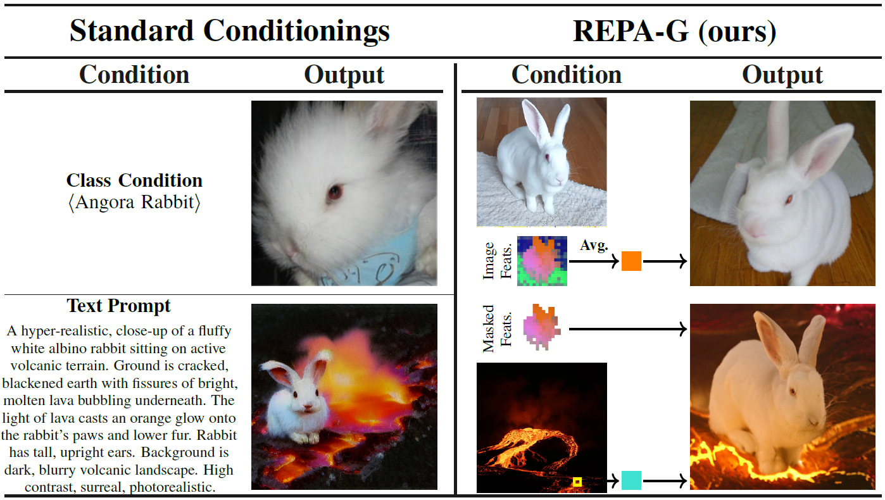
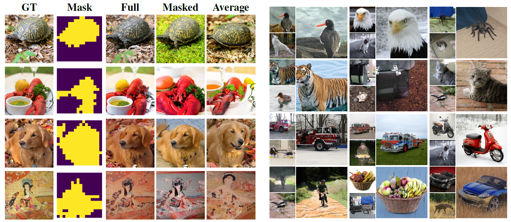

<h1 align="center"> REPA-G - Official implementation of "Test-Time Conditioning with Representation-Aligned Visual Features"</h1>

<p align="center">
  <a href="https://scholar.google.com/citations?user=9Mr--hUAAAAJ" target="_blank">Nicolas&nbsp;Sereyjol-Garros</a><sup>1</sup> &ensp; <b>&middot;</b> &ensp;
  <a href="https://ellingtonkirby.github.io/" target="_blank">Ellington&nbsp;Kirby</a><sup>1</sup> &ensp; <b>&middot;</b> &ensp;
  <a href="https://scholar.google.com/citations?user=YhTdZh8AAAAJ&hl=en" target="_blank">Victor&nbsp;Letzelter</a><sup>1,2</sup> &ensp; <b>&middot;</b> &ensp;
  <a href="https://scholar.google.com/citations?user=n_C2h-QAAAAJ&hl=en" target="_blank">Victor&nbsp;Besnier</a><sup>1</sup> &ensp; 
  <a href="https://nerminsamet.github.io/" target="_blank">Nermin&nbsp;Samet</a><sup>1</sup>&ensp;<b>&middot;</b> &ensp;
</p>

<p align="center">
  <sup>1</sup> Valeo.ai, Paris, France &emsp; </sub> <sup>2</sup> LTCI, Télécom Paris, Institut Polytechnique de Paris, France  &emsp;
</p>

<p align="center">
  <!-- <a href="">🌐 Project Page</a> &ensp; -->
  <a href="">📃 Paper</a>
</p>



## Overview

While representation alignment with selfsupervised models has been shown to improve diffusion model training, its potential for enhancing inference-time conditioning remains largely unexplored. We introduce Representation-Aligned Guidance (REPA-G), a framework that leverages these aligned representations, with rich semantic properties, to enable test-time conditioning from features in generation. By optimizing a similarity objective (the potential) at inference, we steer the denoising process toward a conditioned representation extracted from a pre-trained feature extractor. Our method provides versatile control at multiple scales, ranging from fine-grained texture matching via single patches to broad semantic guidance using global image feature tokens. We further extend this to multi-concept composition, allowing for the faithful combination of distinct concepts. REPA-G operates entirely at inference time, offering a flexible and precise alternative to often ambiguous text prompts or coarse class labels. We theoretically justify how this guidance enables sampling from the potential-induced tilted distribution. Quantitative results on ImageNet and COCO demonstrate that our approach achieves high-quality, diverse generations.




## 📚 Citation
If you find our work useful, please consider citing:

```bibtex
@misc{sereyjol2026repag,
      title={Test-Time Conditioning with Representation-Aligned Visual Features}, 
      author={Nicolas Sereyjol-Garros and Ellington Kirby and Victor Letzelter and Victor Besnier and Nermin Samet},
      year={2026},
      archivePrefix={arXiv},
      primaryClass={cs.CV},
}
```
## Getting Started
### 1. Environment Setup
To install depedencies, please run:

```bash
pip install -r requirements.txt
```

### 2. Download the pretrained model

To Download together REPA-E, REPA and SiT without alignmnet, run the script 

```bash 
bash scripts/download/download_sit.sh
```

### 3. Demo

Run the demo with
```bash
streamlit run app/home.py
```

### (Optional) Download additional visual backbone for evaluation

For evaluation of alignment with anchors with additional image backbone, download the image backbones needed and put them in `ckpts`

* `mocov3` : [this link](https://dl.fbaipublicfiles.com/moco-v3/vit-b-300ep/vit-b-300ep.pth.tar) and place it as `./ckpts/mocov3_vitb.pth` 
* `JEPA` : [this link](https://dl.fbaipublicfiles.com/ijepa/IN22K-vit.h.14-900e.pth.tar) and place it as `./ckpts/ijepa_vith.pth`
* `MAE` : [this link](https://dl.fbaipublicfiles.com/mae/pretrain/mae_pretrain_vit_large.pth) and place it as `./ckpts/mae_vitl.pth`

or run the script 

```bash 
bash scripts/download/download_image_backbone.sh
```

### 4. Prepare ImageNet
Download and extract the training split of the [ImageNet-1K](https://www.image-net.org/challenges/LSVRC/2012/index) dataset. Once it's ready, run the following command to preprocess the dataset:

```bash
python preprocessing.py --imagenet-path /PATH/TO/IMAGENET_TRAIN
```

Replace `/PATH/TO/IMAGENET_TRAIN` with the actual path to the extracted training images.


### 5. Evaluate

Download reference file for ImageNet with
```bash
bash scripts/download/download_ref_in.sh
```

Example scripts for generation and evaluation (average feature conditioning) are provided in `scripts/eval`. Run for example,
```bash
bash scripts/eval/eval_imagenet_repae.sh
```


## Acknowledgement
This codebase is largely built upon:
- [REPA-E](https://github.com/End2End-Diffusion/REPA-E)

We sincerely thank the authors for making their work publicly available.

